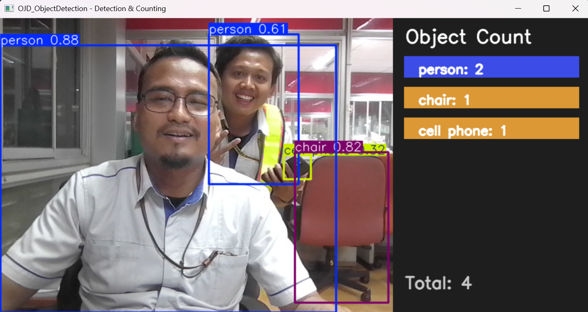

# OJD_ObjectDetection  
**Real-Time Object Identification & Counting (YOLOv8 + OpenCV)**  

This repository contains a lightweight demo project for real-time object detection using YOLOv8 (Ultralytics) and OpenCV, with a modern right-side panel that counts detected objects by class.

---

## ✨ Features  
- 🧠 Real-time object detection from webcam using **YOLOv8 (Ultralytics)**  
- 📊 Right-side panel with **colored badges per object class and counts**  
- ⚡ Lightweight model (`yolov8n.pt`) for fast performance  
- 💻 Main detection script: `camera_object_count.py`

---

## ⚙️ Installation & Quickstart  

### 1️⃣ Clone Repository  
```bash
# bash
git clone https://github.com/apdaniswara-sys/OJD_ObjectDetection.git
cd OJD_ObjectDetection
```

---

### 2️⃣ Create Virtual Environment
```bash
# bash
python -m venv env_obj_dtc

# Windows PowerShell
.\env_obj_dtc\Scripts\Activate.ps1

# or cmd
env_obj_dtc\Scripts\activate.bat
```
If PowerShell blocks execution, run this first:
```powershell
# powershell
Set-ExecutionPolicy -Scope Process -ExecutionPolicy Bypass
```

---

### 3️⃣ Install Dependencies
```bash
# bash
pip install -r requirements.txt
```

---

### 4️⃣ Run Detection Demo
```bash
# bash
python src/camera_object_count.py
```
Press q to quit the camera window.

---

## 🗂️ Project Structure
```bash
# Plain Text
OJD_ObjectDetection/
│
├── requirements.txt
├── .gitignore
│
├── src/
│   ├── camera_object_count.py      # main detection + counting script
│   └── utils/
│       └── draw_utils.py           # helper for drawing side panel
│
├── assets/
│   └── demo_preview.jpg            # example output image
│
└── README.md
```

---

## 🧠 How It Works
```bash
# bash
from ultralytics import YOLO
import cv2

model = YOLO("yolov8n.pt")
cap = cv2.VideoCapture(0)

while True:
    ret, frame = cap.read()
    results = model(frame)
    annotated = results[0].plot()
    cv2.imshow("OJD Object Detection", annotated)
    if cv2.waitKey(1) & 0xFF == ord('q'):
        break

cap.release()
cv2.destroyAllWindows()
```

---

## 🖼️ Demo Preview
Below is an example visualization of the detection window and side panel:


---

## 🧩 Notes
- The model yolov8n.pt will be automatically downloaded the first time it runs.
- Default resolution: 640x480 for performance balance.
- To use your own camera index, edit line in camera_object_count.py:
```bash
# bash
cap = cv2.VideoCapture(0)
```

---

### 🛠️ Author
Created by apdaniswara-sys (Muizz)
📅 Last Updated: November 2025
📧 Contact: apdaniswara@gmail.com

⭐ If you find this project useful, please give it a star on GitHub!